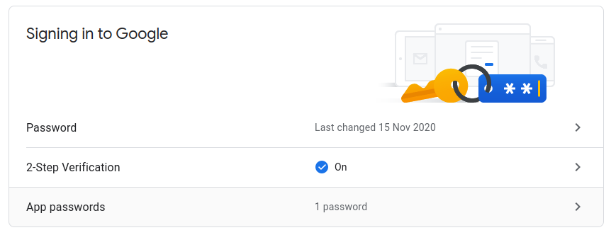
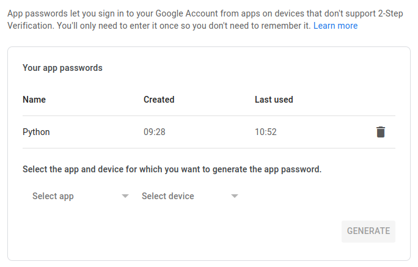
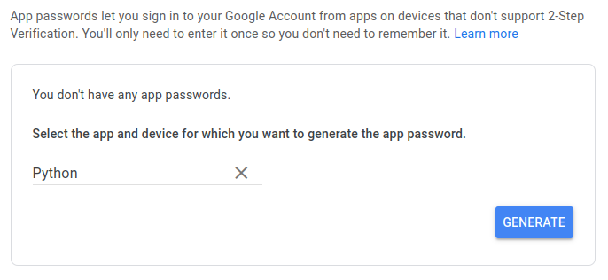
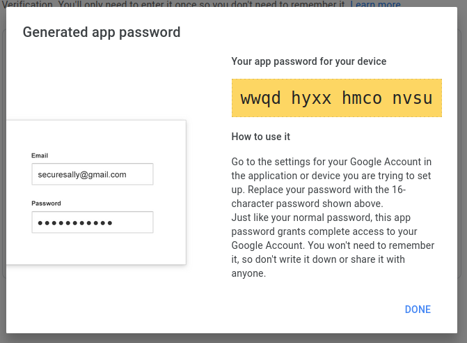
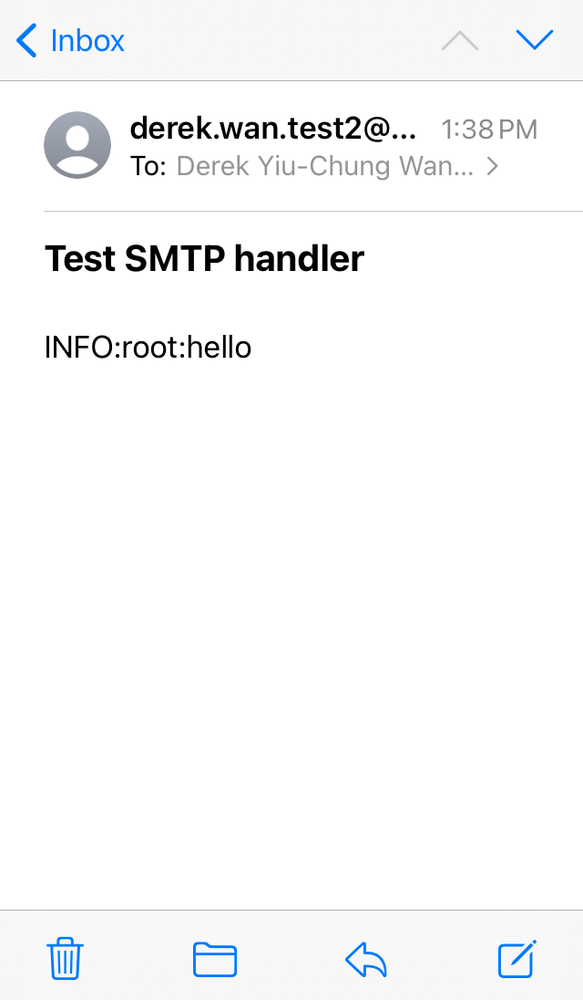

# ssl-smtp-handler

[](https://badge.fury.io/py/ssl-smtp-handler)

## Introduction

I wanted an easy way to send emails for my Python projects, with code that was
adapted for today's (2021) way of doing things. This `Handler` is designed for
use with the Python standard library.

## Requirements

- Python 3.6+ (the currently supported versions of Python)

## Installation

```sh
pip install ssl-smtp-handler
```

## Usage

Gmail is probably the easiest to set up. For example:

```python
from logging import basicConfig, info
from ssl_smtp_handler import SSLSMTPHandler

handler = SSLSMTPHandler(
    mailhost='smtp.gmail.com',
    fromaddr='from@gmail.com',
    toaddrs=['to@gmail.com'],
    subject='Example subject',
    credentials=('username@gmail.com', 'wwqdhyxxhmconvsu'),
)
handler.setLevel('INFO')
basicConfig(handlers=[handler], level='INFO')
info('This is an example message')
```

To try this for yourself, get hold a Gmail account and enable 2-Step
verification:



Create an app password:



Name it whatever you want:



Use this password in your program:



Emails will look like this:


